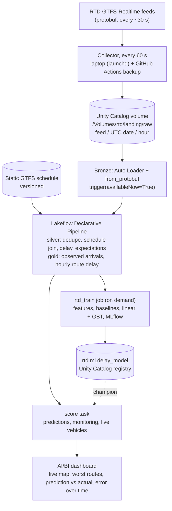

# RTD Delay Radar

**Real-time transit delay prediction for Denver RTD, built as a streaming lakehouse on Databricks.**

A small collector polls RTD's live GTFS-Realtime feeds every minute. Spark Structured Streaming and a Lakeflow Declarative Pipeline turn the raw protobuf files into bronze, silver, and gold Delta tables. A model predicts how late a bus or train will be 1 to 20 stops ahead, and it is compared against two baselines: "the delay stays the same" (persistence) and RTD's own prediction. An AI/BI dashboard shows live delays and how every predictor performs over time.

Everything is deployed as code with Databricks Asset Bundles and GitHub Actions, on the free tier.

## Status

| Milestone | State |
|---|---|
| M0 Setup and spikes | Done |
| M1 Collector | Running since 2026-10-06. Uptime so far 72.8% (see [Data collection](#data-collection)) |
| M2 Bronze and silver | Running in prod every 2 hours |
| M3 Gold tables and labels | Running in prod |
| M4 Features and model | Built and pipeline-tested. **Results pending full data** (earliest 2026-10-27) |
| M5 Scoring and dashboard | Running in prod with baseline predictions until a model is approved |
| M6 CI/CD and write-up | In progress |

## Architecture



One job, `rtd_refresh`, runs every 2 hours: bronze, then the silver and gold pipeline, then scoring. Training is a separate job run on purpose with a date range.

## What is interesting here

- **Streaming on a free quota.** Structured Streaming with checkpoints and exactly-once ingestion, run as `availableNow` bursts every 2 hours instead of an always-on stream that would exhaust the Free Edition quota.
- **Labels from a feed that only publishes predictions.** RTD drops a stop from a trip update once the vehicle passes it. The last prediction before that, if made at most 2 minutes ahead, is the observed arrival. With continuous collection, 96% to 98% of trip-stops get a trusted label.
- **Leakage-safe features.** Every feature is defined as of the prediction time, using as-of joins for "the vehicle ahead" and "RTD's latest prediction". Each risky feature has a unit test that puts future data in and checks it is ignored. Train/test split is by service date, never random.
- **One feature function for training and scoring,** so the deployed model sees features computed exactly as in training.
- **Real data problems found and handled:** RTD's trip update `start_date` is a day behind for early-morning trips (detected and corrected, rate tracked by an expectation). A Python protobuf UDF ran out of memory on daytime snapshots (replaced by Spark's `from_protobuf`, cross-checked field by field). Daylight saving days are handled with the GTFS "noon minus 12 hours" rule.

Details: [architecture](docs/architecture.md), [design decisions](docs/decisions.md), [results](docs/results.md).

## Results

**Pending full data.** The plan needs at least 3 weeks of history with a full held-out week. Any model trained before then is a pipeline test, tagged `data_status=preliminary`, and not reported. The first full retrain is planned for 2026-10-27:

```bash
databricks bundle run -t prod rtd_train --params start=2026-10-06,end=2026-10-27
```

Results will report MAE and RMSE in seconds for persistence, RTD's prediction, linear regression, and gradient-boosted trees, split by bus vs rail and by horizon (1, 5, 10, 20 stops ahead), including where the model loses.

## Data quality (silver expectations, first day)

| Check | Pass rate |
|---|---|
| Trip id present, delay within ±2 h, matched to the static schedule | 100% |
| RTD's start date correct (warn only, corrected when wrong) | 99.93% |
| Vehicle position inside the Denver area | 99.88% |

## Data collection

RTD feeds only show the present, so history exists only while the collector runs. Gaps are measured, not hidden or filled.

- 2026-10-06 08:57 to 2026-10-08 06:00 UTC: 45 hours, 21 gaps longer than 5 minutes, 12.2 hours missing (uptime 72.8%).
- Cause: the laptop collector stops when the Mac sleeps with the lid closed. The GitHub Actions backup runner covers this once its repository secrets are configured.
- Gap log: [PROGRESS.md](PROGRESS.md). Check any time with `uv run python -m src.collector.health --volume`.

## Limitations

- **Databricks Free Edition:** serverless compute only, a daily usage quota, and a cap on how much compute runs at once. Jobs are kept to one at a time.
- **Not real time:** streaming runs in scheduled bursts, so tables and the dashboard are up to about 2 hours old.
- **Labels are RTD's last prediction before arrival**, not a measured arrival time. At 1 stop ahead, RTD's prediction and the label are nearly the same thing, so RTD is very hard to beat there.
- **Polling runs outside Databricks.** Serverless can reach RTD, but polling every minute from Databricks would use the quota.
- **Latest static schedule only.** Silver joins every day to the newest schedule version. Fine within one schedule period; needs a version-by-date join once RTD changes schedules during collection.

## Setup

Requires Python 3.11, [uv](https://docs.astral.sh/uv/), the [Databricks CLI](https://docs.databricks.com/dev-tools/cli/install.html), and Java 17 for local Spark tests.

```bash
uv sync                                     # install dependencies
uv run ruff check && uv run pytest          # lint and unit tests (local Spark)
databricks auth login --host <workspace>    # browser OAuth, no tokens in files
uv run python -m src.common.setup_catalog   # catalog rtd, schemas, volumes (once)
uv run python -m src.collector.static_gtfs  # upload the static GTFS schedule
databricks bundle deploy                    # dev target: dev_* schemas, one day of data
databricks bundle run rtd_refresh           # dev: bronze, silver, gold, scoring
```

Collector:

```bash
sh ops/install_collector_agent.sh                # laptop: launchd keeps it running and awake
uv run python -m src.collector.health --volume   # date range and gaps over 5 minutes
```

CI/CD (`.github/workflows/`): `ci.yml` runs lint, unit tests, and bundle validation on pull requests; `deploy.yml` deploys the prod target on every push to `main`; `collector.yml` is the backup collector. The Databricks steps need repository secrets `DATABRICKS_HOST` and `DATABRICKS_TOKEN`.

## Repository layout

```
src/collector/    polling, upload, health and freshness checks, static GTFS download
src/bronze/       Auto Loader ingestion and protobuf decoding
src/pipelines/    silver and gold transforms (pure functions) and the Lakeflow pipeline files
src/features/     training and live feature builder
src/ml/           evaluation, models, training job, scoring job
src/dashboards/   AI/BI dashboard definition
resources/        bundle jobs, pipeline, dashboard
notebooks/        exploration and error analysis only
tests/            unit tests and small real RTD snapshots
docs/             architecture, decisions, results, interview prep
```

## Data and license

RTD GTFS and GTFS-Realtime data, used under RTD's license agreement. Raw data is not stored in this repository; only small test snapshots are.
